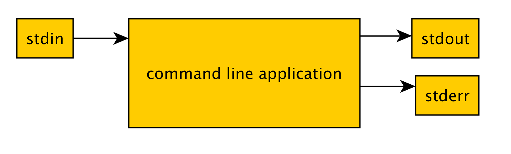
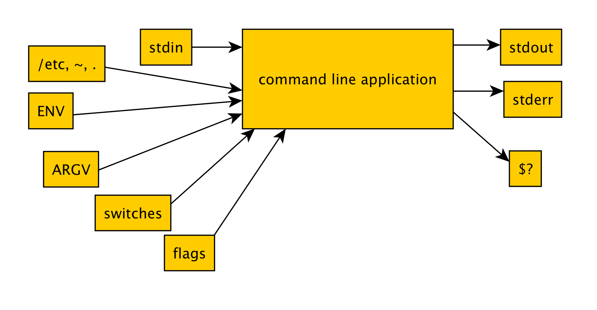

# Somecli

>Hacking on command line application conventions.

I tell everyone command line applications are like this



But usually they're like this



## Usage example

```
echo -n foo bar baz | ./somecli -s -f flap jacks; echo $?
ARGV=["jacks"]
options={:"another-switch"=>true, :"even-yet-another-switch"=>true, :switch=>true, :flag=>"flap"}
ENV['cats']="flapjacks"
STDIN.read="foo bar baz"
stderr: hello world!
stdout: hello world!
0
```
 